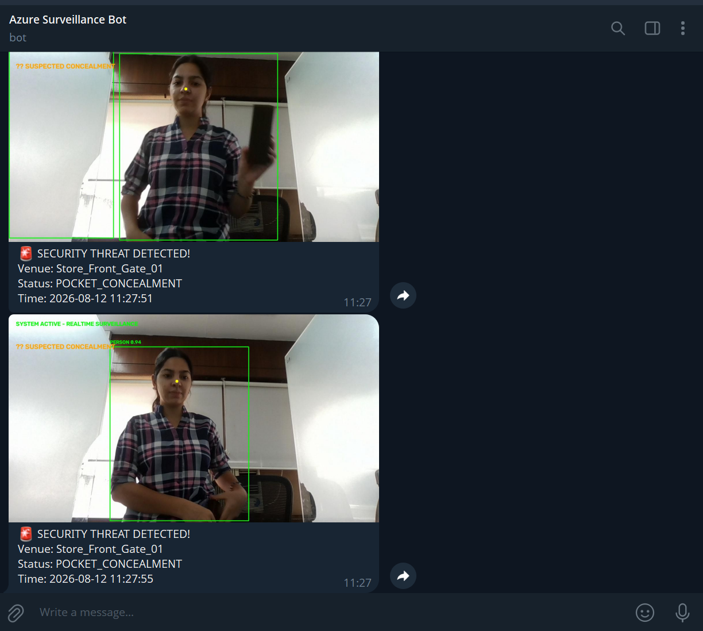
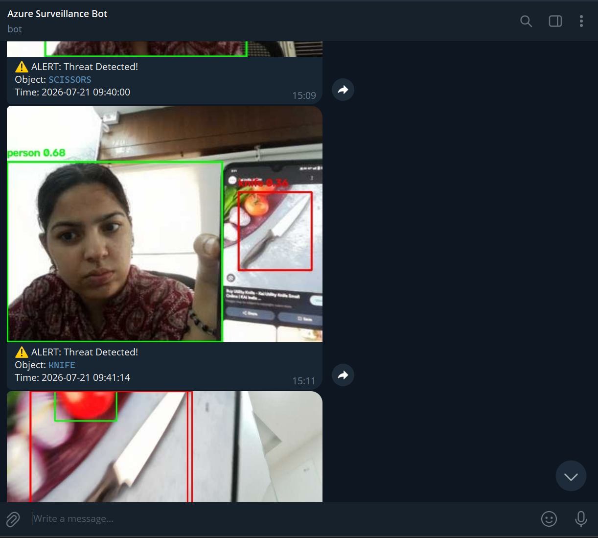
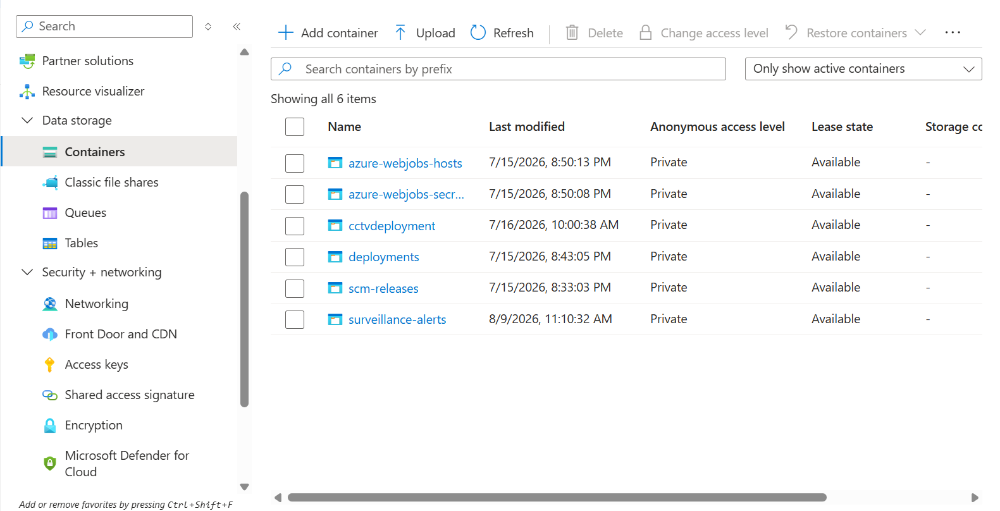
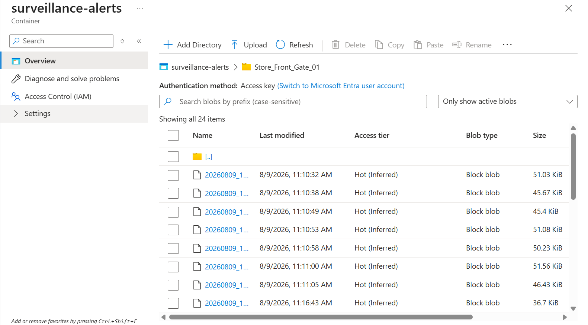

# 🛡️ Sentinel — Enterprise AI Surveillance Cloud Application

A real-time AI surveillance web application that combines **YOLOv8 object & pose detection**, **live WebSocket video streaming**, **Azure Blob Storage backup**, and **instant Telegram alerts** — built to detect weapons, suspicious posture, and violent motion as they happen.

> ⚠️ This is a prototype/learning project. See [Limitations](#-limitations--disclaimer) before using it in any real security context.

**🟢 Deployment Status:** Live and running on an **Azure Virtual Machine** (private/internal deployment — not publicly exposed). See [Current Deployment](#️-current-deployment) for details.

---

## 📸 Demo

### Telegram Alert Feed

| Pocket Concealment Alerts | Weapon Alerts (Scissors / Knife) |
|---|---|
|  |  |

### Azure Blob Storage Backup

| Storage Account — Containers | `surveillance-alerts` Container — Synced Evidence |
|---|---|
|  |  |

🎥 [Watch the full demo video](Testing_video.mp4)

---

## ✨ Key Features

- **🔫 Real-Time Threat Detection** — Detects weapons (knives, scissors) in live video with bounding boxes and confidence scores.
- **🕴️ Pose & Behavior Analytics** — Flags face concealment, pocket/concealment gestures, and sudden violent hand motion using keypoint tracking.
- **📁 Centralized Incident Logging** — Time-stamped snapshots saved locally in `detections/` for audit trails.
- **☁️ Automated Cloud Backup** — Verified threat evidence is auto-uploaded to Azure Blob Storage.
- **📲 Instant Telegram Alerts** — Push notifications with threat type, venue, timestamp, and snapshot image sent directly to a Telegram chat/channel.
- **🌐 Live Browser Dashboard** — Side-by-side raw camera feed and AI-annotated feed streamed over WebSockets, with a live event log table.

---

## 🛠️ Tech Stack

| Layer | Technology |
|---|---|
| Computer Vision | Ultralytics YOLOv8 (object detection + pose estimation), OpenCV |
| Backend | Python 3.10+, FastAPI, WebSockets, Uvicorn |
| Cloud Storage | Azure Blob Storage |
| Alerting | Telegram Bot API |
| Frontend | HTML/CSS/JS (vanilla, served via FastAPI) |

---

## 🏗️ Architecture

```
 Browser Camera ──(base64 JPEG frames)──▶ WebSocket (/ws)
                                              │
                                              ▼
                                   FastAPI async handler
                                              │
                              ┌───────────────┼────────────────┐
                              ▼               ▼                ▼
                        YOLOv8 Object    YOLOv8 Pose      Behavior Rules
                        Detection        Estimation       (concealment,
                        (weapons)        (keypoints)       violent motion)
                              │               │                │
                              └───────────────┴────────────────┘
                                              │
                                     Threat detected?
                                              │
                              ┌───────────────┴────────────────┐
                              ▼                                ▼
                     Telegram Bot API                  Azure Blob Storage
                     (instant alert + photo)            (evidence backup)
                              │
                              ▼
                     Annotated frame streamed back to browser + logged in UI
```

---

## 🚀 Getting Started

### Prerequisites

- Python 3.10+
- A webcam-enabled browser (Chrome/Edge recommended)
- A [Telegram Bot](https://core.telegram.org/bots#how-do-i-create-a-bot) token + chat ID
- An [Azure Storage Account](https://learn.microsoft.com/en-us/azure/storage/blobs/storage-quickstart-blobs-portal) connection string

### 1. Clone the repository

```bash
git clone https://github.com/bhartibhatt810-ux/ai-surveillance.git
cd ai-surveillance
```

### 2. Create a virtual environment & install dependencies

```bash
python -m venv venv
source venv/bin/activate      # Windows: venv\Scripts\activate
pip install -r requirements.txt
```

### 3. Configure environment variables

Create a `.env` file in the project root (never commit this file):

```env
TELEGRAM_BOT_TOKEN=your_telegram_bot_token
TELEGRAM_CHAT_ID=your_telegram_chat_id
AZURE_CONNECTION_STRING=your_azure_storage_connection_string
AZURE_CONTAINER_NAME=surveillance-alerts
VENUE_LOCATION=Store_Front_Gate_01
```

> Update `app.py` to load these via `python-dotenv` / `os.environ` instead of hardcoded placeholders.

### 4. Run the app

```bash
uvicorn app:app --reload --host 0.0.0.0 --port 8000
```

### 5. Open the dashboard

Visit `http://localhost:8000` in your browser and allow camera access.

---

## ☁️ Current Deployment

This project is **actively deployed on an Azure Virtual Machine** (Linux/Ubuntu):

- **Compute:** Azure VM running the FastAPI/Uvicorn server
- **Storage:** Azure Blob Storage (`surveillance-alerts` container) for verified threat evidence — see screenshots above
- **Alerting:** Telegram Bot integrated with the live instance for real-time push notifications
- **Access:** Currently private/internal — not exposed on a public URL

### Deploying your own instance

1. Provision an Ubuntu Linux VM on Azure.
2. Install Python, clone the repo, set up the `.env` file as described above.
3. Run with a production ASGI setup, e.g.:
   ```bash
   uvicorn app:app --host 0.0.0.0 --port 8000 --workers 2
   ```
4. Put it behind Nginx + a systemd service for persistence, and use **HTTPS/WSS** (not plain `ws://`) for camera frame transport in production.
5. Restrict network access (NSG rules / firewall) since the dashboard currently has no built-in authentication.

---

## 📂 Project Structure

```
ai-surveillance/
├── app.py
├── detections/
├── requirements.txt
├── .env.example
├── README.md
└── assets/
    ├── azure1.png
    └── telegramphoto1.png
```

---

## 🗺️ Roadmap

- [ ] Move secrets to `.env` / environment variables
- [ ] Add authentication for dashboard & WebSocket access
- [ ] Split `app.py` into modules (`detection.py`, `alerts.py`, `storage.py`) + Jinja2 templates
- [ ] Multi-camera / RTSP stream support
- [ ] Dockerfile + docker-compose for one-command deployment
- [ ] Temporal smoothing (N-frame confirmation) to reduce false positives
- [ ] Analytics dashboard (daily/weekly threat charts)
- [ ] Role-based access (admin vs. viewer)
- [ ] CI pipeline (lint + tests via GitHub Actions)

---

## ⚠️ Limitations & Disclaimer

- Pose-based rules (face covering, pocket concealment) use simple distance thresholds and **can produce false positives** — this is a prototype, not a certified security system.
- No authentication is currently implemented; do not expose this publicly without adding access control.
- Detection accuracy depends on camera angle, lighting, and YOLOv8 model limitations (COCO-pretrained weights are not weapon-specialized).
- This project is intended for **educational/demo purposes**. Consult local laws and privacy regulations before deploying any surveillance system that captures identifiable individuals.

---

## 🙋 Author

**Bharti Bhatt** — [GitHub](https://github.com/bhartibhatt810-ux)
